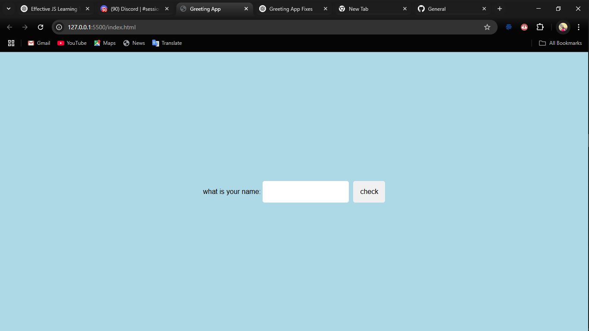

# 👋 Greeting App

A simple and interactive web app that greets the user by their name using **HTML**, **CSS**, and **JavaScript**.

---

## ✨ Features

- User-friendly interface
- Personalized greeting in uppercase
- Input and question temporarily hidden after greeting
- Input is cleared and reset after a few seconds
- Smooth interaction with minimal UI

---



---

## 🚀 How It Works

1. The user enters their name in the input field.
2. Clicking the **"check"** button displays a greeting.
3. The input section disappears temporarily.
4. After 3 seconds, the input and prompt return, and the field is cleared.

---

## 🧠 Technologies Used

- **HTML** – structure
- **CSS** – styling
- **JavaScript** – behavior & interactivity

---

## 📂 Project Structure

greeting-app/
├── index.html
├── styles.css
├── script.js
├── README.md
├── LICENSE
└── assets/
└── screenshot.png

--

## 📦 How to Run

1. Clone the repository:

```bash
git clone https://github.com/Sulley-Sadick/greeting-app.git

```

````2 Open the project folder

cd greeting-app

``` 3 Open index.html in your brower.
``` 4. start greeting yourself and others 🎉

````
